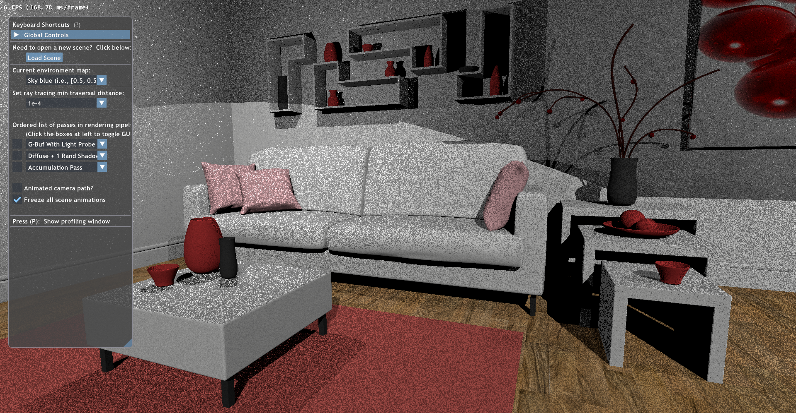
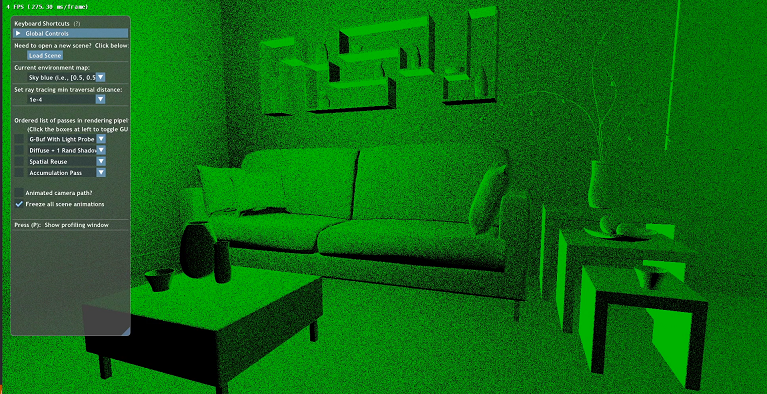
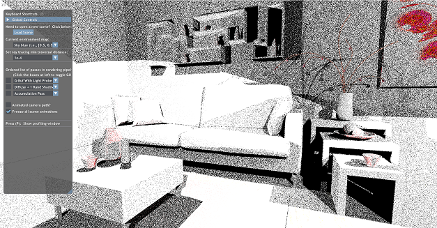

# Reservoir Spatio Temporal Importance Resampling (ReSTIR)

* Sydney Miller: [LinkedIn](https://www.linkedin.com/in/sydney-miller-upenn/), [portfolio](https://youtu.be/8jFfHmBhf7Y), [email](millersy@seas.upenn.edu)
* Sireesha Putcha: [LinkedIn](https://www.linkedin.com/in/sireesha-putcha/), [portfolio](https://sites.google.com/view/sireeshaputcha/home), [email](psireesha98@gmail.com)
* Thy Tran: [LinkedIn](https://www.linkedin.com/in/thy-tran-97a30b148/), [portfolio](https://tatran5.github.io/demo-reel.html), [email](tatran@seas.upenn.edu)

## Outlines
* [Introduction](#introduction)
* [Results](#results)
* [Performance analysis](#performance-analysis)
* [ReSTIR explained](#restir-explained)
* [Progress](#progress)
* [Build and run](#build-and-run)
* [Credits and resources](#credits-and-resources)

## Introduction

This is a team project implementing ReSTIR based on the [research paper](https://research.nvidia.com/sites/default/files/pubs/2020-07_Spatiotemporal-reservoir-resampling/ReSTIR.pdf) with the same title, published by NVIDIA in 2020. Briefly, the purpose of ReSTIR is to help rendering scenes with a lot of lights but make it much less noisy than the basic path tracing algorithm. This is a result of continuously finding and updating the most ideal light for a pixel based on its surrounding neighbor pixels and its light in previous frames.

## Results

## Performance analysis
*Analyze performance at crucial steps or final step with ground truth*

### Visual analysis

#### Light candidates generation


The above is a rendered image after implementing light candidate generation per reservoir. Below is our comparison with ground truth.

|Ground truth (multiple frames)| Ground truth (first frame) | ReSTIR (first frame, no spatial or temporal reuse)|
|---|---|---|
||||

Because there's no temporal reuse here, we only mainly compare the firs frame of ground truth and our implementation. There is a clear improvement by only adding light candidates generation and picking one with more influence on the current pixel. The base image (first frame) is much more grainy with many shadows that are not reflected in the final ground truth (accumulation through multiple frames.) In contrast, the ReSTIR image does not have large areas of shadow that are not in the ground truth with multiple-frames accumulation. 

|Ground truth (multiple frames)| Ground truth (first frame) | ReSTIR (first frame, no spatial or temporal reuse)|
|---|---|---|
||||

|Ground truth (multiple frames)| Ground truth (first frame) | ReSTIR (first frame, no spatial or temporal reuse)|
|---|---|---|
||||

The reason for this is due to better sampling - choosing lights that are have more effects on each pixel, versus choosing some random light.

### Runtime analysis

## ReSTIR explained 
*Please let us know if you find any errors in our understandings of the paper.*

### Overview
For each pixel:
1. Select 1 light from randomly 32 chosen lights
2. Shoot a shadow ray from the light to the pixel. If it is obscured, discard the chosen light.
3. Compare the light used in the last iteration to the light from step 2 and choose one.
4. Compare the lights from random adjacent pixels to light from step 3 and choose one.
5. Shoot a shadow ray to light from step 4 and shade the pixel.

This uses a combination of Weighted Reservoir Sampling and Resampled Importance Sampling to select and compare lights. 

### Details

We uses a data structure called reservoir for each pixel that holds the current light and sum of all weights seen for the light. Each light candidate has a weight corresponding to their chance of being chosen as the current sampled light per pixel.

* 

    *  : the BSDF of the current point, which is the material color given the incident and outgoing light ray.
    *  : light emmitance from a chosen point on the light to the current point.
    *  : the solid angle term, where  is the normal vector at the current point,  is the direction from the current point to a chosen point on the light, while  is the normal at the chosen point on the light, and  is the vector from the chosen point to the current point. $x$ and $x'$ respectively are the current point and the chosen point on the light. In the case that the light itself is a point light, the numerator is reduced to the dot product of the normal vector at the current point and the ray direction from the point to the light over the denominator.

## Potential improvements
*To be updated once the project is complete*

## Progress
*This serves as our "diary" of problems and solutions, useful for us as teammates to know each other's progress, as well as solutions to bugs if encountering similar ones.*

* [Requirement hurdles](#requirement-hurdles)
* [Nonsense errors with debug or release mode](#nonsense-errors-with-debug-or-release-mode)
* [Initializing light candidates](#initializing-light-candidates)
* [Spatial reuse](#spatial-reuse)

### Requirement hurdles

#### Hardware
Our team did not all Windows computer, and we ended up having to remotely connect to an available computer at our college. However, Developer Mode was not enabled on any of those computers, so there was some communication with the school IT, and they quickly helped us with setting up some computers at a lab with Developer Mode with DXR-fallback graphics cards. We also had asked for admin access to those computers in case we would to make changes that requires admin acess just like switching to Developer Mode, but we understandably did not have the permission. We still couldn't get our base code to run on those computers despite Developer Mode turned on, and after some digging, we found that Falcor library does not support DXR fallback, so another conversation with the school IT happened. 

This whole process took place in 2 weeks. We tried to have other options available to us because we were on time crunch and worried of facing more problems with school computers due to restricted access on any computer. Other options on the table includes Amazon Web Services and using someone's PC. However, the AWS Educate program, which is free for students, did not allow us to have access to a GPU with DXR, and the normal AWS account would cost quite a bit. We went ahead and set things up with a normal account anyway, and also borrowed someone's computer with the specifications but limited time access per day as the back up plan for AWS and to potentially cut cost if we have to use AWS account. 

Fortunately, in the end, our school IT helped us set things up at a lab that had computers with graphics cards that met our requirements. 

#### Restrictions on remote computers
We still could not build the project on the provided computers by our school. We narrowed down that a .bat file to update dependencies for Falcor library for some reasons could not run. After some debugging effort, we realized that the .bat file needs to run some PowerShell files, but the school computers do not allow us to run .ps1 files that are not digitally signed by the school itself. There went another exchange with our school IT. They ended up configuring on I configured the PowerShell Execution Policy on those machines to allow .ps1 files to run and added us to the Local Administrators Group so that we could make changes to the machines as needed. We did run into the problems where VS threw error for missing [pybind11 library](https://pybind11.readthedocs.io/en/stable/installing.html), and we were able to resolved by installing it.

### Nonsense errors with debug or release mode
The errors can be something like "missing ';' before..." even though it is not true. The project must be run in DebugD3D12 or ReleaseD3D12 mode, **not** the usual Debug and Release mode due to DirectX 12.

### Initializing light candidates
The files that were changed include ```DiffuseOneShadowRayPass.cpp```, ```diffusePlus1Shadow.rt.hlsl```, and ```diffusePlus1ShadowUtils.hlsli```

* [DiffuseOneShadowRayPass.cpp](#diffuseoneshadowraypasscpp)
* [diffusePlus1ShadowUtils.hlsli](#diffuseplus1shadowutilshlsli)
* [diffusePlus1Shadow.rt.hlsl](#diffuseplus1shadowrthlsl)
* [Tips for debugging light candidates generation](#tips-for-debugging-light-candidates-generation)
* [Bloopers of light candidates generation](bloopers-of-light-candidates-generation)

#### DiffuseOneShadowRayPass.cpp

To store the data for reservoir per pixel, we need to create a G-buffer. Hence, in ```DiffuseOneShadowRayPass::initilize```, we request DirectX to allocate resources for the G-buffer as below:

```
bool DiffuseOneShadowRayPass::initialize(RenderContext* pRenderContext, ResourceManager::SharedPtr pResManager)
{
	...
	mpResManager->requestTextureResources({ "WorldPosition", "WorldNormal", "MaterialDiffuse", "Reservoir"});
	...
}
```

We also need to pass the ```Reservoir``` G-buffer down into the shader. This is done in ```DiffuseOneShadowRayPass::execute```
```
void DiffuseOneShadowRayPass::execute(RenderContext* pRenderContext)
{
	...
	// For ReSTIR - update the buffer storing reservoir (weight sum, chosen light index, number of candidates seen) 
	rayGenVars["gReservoir"]   = mpResManager->getTexture("Reservoir"); 
}
```
#### diffusePlus1ShadowUtils.hlsli
We added a utility function in this file corresponding to algorithm 2 of the paper to update the reservoirs: 
```
float4 updateReservoir(float4 reservior, int sample, double weight) {
	// Algorithm 2 of ReSTIR paper
	reservoir.x = reservoir.x + weight;
	reservoir.z = reservoir.z + 1.0f;
	if (nextRand(randSeed) < weight / reservoir.x) {
		reservoir.y = lightToSample;
	}

	return reservior;
}
```

#### diffusePlus1Shadow.rt.hlsl
We need to include the buffer ```gReservoir``` in the shader. Note that ```gReservoir``` is a texture of float4 where the first float (.x) is the weight sum, the second float (.y) is the chosen light for the pixel, while the third float (.z) is the number of samples seen for this current light, and the last float (.w) is the final adjusted weight for the current pixel following the given formula in algorithm 3 of the paper where  (here  is the light candidates seen by the reservoir, and   is the weight sum of all light candidates seen by the reservoir.)

```
RWTexture2D<float4> gReservoir;
```

Finally within the function ```void SimpleDiffuseGIRayGen()```, we add the step where the pixel picks random 32 lights, then choose the best one among of of them as below, and update the reservoirs each iteration and do a shadow test before the pixel is finally shaded: 
```
void LambertShadowsRayGen() {
		...
		// Algorithm 3 of ReSTIR paper
		for (int i = 0; i < 32; i++) {
			lightToSample = min(int(nextRand(randSeed) * gLightsCount), gLightsCount - 1);
			getLightData(lightToSample, worldPos.xyz, toLight, lightIntensity, distToLight);
			LdotN = saturate(dot(worldNorm.xyz, toLight)); // lambertian term

			// weight of the light is f * Le * G / pdf
			weight = length(difMatlColor.xyz * lightIntensity * LdotN / (distToLight * distToLight)); // technically weight is divided by pdf, but point light pdf is 1

			reservoir = updateReservoir(launchIndex, lightToSample, weight);
		}

		reservoir.x = (1.0 / reservoir.z) * reservoir.x;
		lightToSample = reservoir.y;

		// A helper (from the included .hlsli) to query the Falcor scene to get this data
		getLightData(lightToSample, worldPos.xyz, toLight, lightIntensity, distToLight);

		// Compute our lambertion term (L dot N)
		LdotN = saturate(dot(worldNorm.xyz, toLight));

		// Shoot our ray.  Since we're randomly sampling lights, divide by the probability of sampling
		//    (we're uniformly sampling, so this probability is: 1 / #lights) 
		float shadowMult = float(gLightsCount) * shadowRayVisibility(worldPos.xyz, toLight, gMinT, distToLight);

		if (shadowMult == 0.0) {
			reservoir.x = 0.0;
		}
		...
```
#### Tips for debugging light candidates generation

It is helpful to output things from the reservoir to help with debugging. 

|Weights (gReservoir.x)| Index of chosen light (gReservoir.y) | Number of light candidates seen (gReservoir.z)|
|---|---|---|
||||

We were able to find a bug where we forgot to update the reservoir by outputing the light candidate seen per reservoir. We expected the image to get brighter over time as above, but the image color stays the same due to the bug.

#### Bloopers of light candidates generation

|Wrong weight calculation| Wrong visibility calculation |
|---|---|
|||

### Spatial reuse
Spatial reuse happens after generating light candidates per reservoir, and each reservoir would sample random neighbor reservoirs and update the current chosen light base on the neighbor chosen lights.

To avoid race conditions of writing into the reservoir buffer in the light candidates initilization versus reading data of neighboring neighbors for spatial reuse, we decided to create a new pass after the light candidate pass. Hence, ```SpatialReusePass.h```, ```SpatialReusePass.cpp``` and ```spatialReuse.rt.hlsl``` are added. They are really similar to the ```DiffuseOneShadowRayPass.h``` and ```DiffuseOneShadowRayPass.cpp``` with some exceptions.

#### ```SpatialReusePass.cpp```

We want avoid reading and writing into a buffer in parallel which can create undefined behaviors. Therefore, we added a new buffer ```Reservoir2``` or ```gReservoir2```. We also need another shader to deal with spatial reuse separating from all the parts above. In ```SpatialReusePass.cpp```, the difference from ```DiffuseOneShadowRayPass.cpp``` is as below to reflect this.

```
namespace {
	// Where is our shader located?
	const char* kFileRayTrace = "Tutorial11\\spatialReuse.rt.hlsl";
	...
}

bool SpatialReusePass::initialize(RenderContext* pRenderContext, ResourceManager::SharedPtr pResManager)
{
	// Stash a copy of our resource manager so we can get rendering resources
	mpResManager = pResManager;
	mpResManager->requestTextureResources({ "WorldPosition", "WorldNormal", "MaterialDiffuse", "Reservoir", "Reservoir2"});
	...
}

void SpatialReusePass::execute(RenderContext* pRenderContext)
{
	...
	// For ReSTIR - update the buffer storing reservoir (weight sum, chosen light index, number of candidates seen, adjusted final weight) 
	rayGenVars["gReservoir"]   = mpResManager->getTexture("Reservoir"); 
	rayGenVars["gReservoir2"]	 = mpResManager->getTexture("Reservoir2");
	...
}
```

We are also planning to ping-pong the reservoirs to make sure the reservoirs are updated correctly.

#### ```spatialReuse.rt.hlsl```

We ran into problems where the Visual Studio giving us errors about "Cannot open file "HostDeviceSharedMacros.h"" even though the .h file is clearly added to the project external dependencies, and the other original ```diffusePlus1Shadow.rt.hlsl``` does not complain. We also found that if we clone the original ```diffusePlus1Shadow.rt.hlsl``` as a new shader then add the file to the project, the error persists. Hence, we thought that it might have to do with project properties or the file properties, and bingo. When comparing ```diffusePlus1Shadow.rt.hlsl``` and ```spatialReuse.rt.hlsl```, we found that under Configuration &rarr General &rarr Item type, the setting in ```diffusePlus1Shadow.rt.hlsl``` is "Does not participate in build", while the default for a newly added .hlsl file is "HLSL Compiler"

#### Update ```diffusePlus1Shadow.rt.hlsl```

We simply output the reservoir value instead of the pixel shading so that we can process the values in the spatial reuse shader, and do the shading in a separate final pass.

### Temporal reuse

## Build and run
*Please let me know if you run into any problems building and running the code. I would be happy to assist, and it would be useful for me to know so I can update this section.*
* **Windows 10 RS5 or later**
    * If you run "winver.exe" you should have Version 1809 (OS Build 17763.)
    * This project does not run on Windows 10 RS4 or earlier.
* **Graphics card**
    * Must support [DirectX Raytracing (DXR)](https://www.nvidia.com/en-us/geforce/news/geforce-gtx-dxr-ray-tracing-available-now/) (**not** fallback layer) due to Falcor library (which does not support fallback layer.)
* **A driver that natively supports DirectX Raytracing**
     * For NVIDIA, use 416.xx or later drivers (in theory any NVIDIA driver for RS5 should work)
* **Visual Studio**
    * Visual Studio 2019. If you have multiple Visual Studio versions, right click on the solution and choose to open the project in Visual Studio 2019.
    * Windows 10 SDK 10.0.17763.0
    * If Visual Studio prompts to upgrade the SDK and version when first opening the solution, hit "cancel".
    * If Visual Studio complains about Falcor library, run ./Falcor/update_dependencies.bat, then go back to Visual Studio to build the solution.
    * If Visual Studio complains about some inaccessible pybind11, try installing [pybind11 library](https://pybind11.readthedocs.io/en/stable/installing.html)
* **Others**
    * Developer Mode must be enabled
    * Permission to run PowerShell files that are not digitally signed

## Credits and resources
* [Jilin Liu](https://www.linkedin.com/in/jilin-liu97/), [Li Zheng](https://www.linkedin.com/in/li-zheng-1955ba169/) and [Keyi Yu](https://www.linkedin.com/in/keyi-linda-yu-8b1178137/) who were also implementing ReSTIR in DirectX as a team. They helped us with clarifying parts of the paper and providing feedback on our project.
* A Gentle Introduction To DirectX Raytracing - [tutorials and base code](http://cwyman.org/code/dxrTutors/dxr_tutors.md.html)
* NVIDIA Falcor [library](https://developer.nvidia.com/falcor)
* ReSTIR [research paper](https://research.nvidia.com/sites/default/files/pubs/2020-07_Spatiotemporal-reservoir-resampling/ReSTIR.pdf)
* NVDIA GTC 2020 [presentation](https://www.nvidia.com/en-us/gtc/session-catalog/?search.language=1594320459782001LCjF&tab.catalogtabfields=1600209910618002Tlxt&search=restir#/session/1596757976864001iz1p) provides a clear high level concept and results of ReSTIR
* Wojciech Jarosz, one of the authors, also has some [presentation](https://cs.dartmouth.edu/wjarosz/publications/bitterli20spatiotemporal.html) in SIGGRAPH 2020 that helps with understanding ReSTIR in a deeper level
