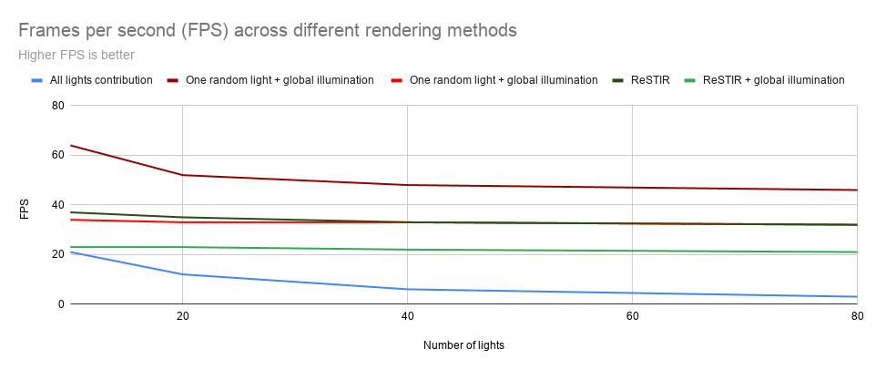

# Reservoir Spatio Temporal Importance Resampling (ReSTIR)

* Sydney Miller: [LinkedIn](https://www.linkedin.com/in/sydney-miller-upenn/), [portfolio](https://youtu.be/8jFfHmBhf7Y), [email](millersy@seas.upenn.edu)
* Sireesha Putcha: [LinkedIn](https://www.linkedin.com/in/sireesha-putcha/), [portfolio](https://sites.google.com/view/sireeshaputcha/home), [email](psireesha98@gmail.com)
* Thy Tran: [LinkedIn](https://www.linkedin.com/in/thy-tran-97a30b148/), [portfolio](https://tatran5.github.io/demo-reel.html), [email](tatran@seas.upenn.edu)

* Tested on Windows 10, i7-8750H @ 2.20GHz 22GB, GTX 1070
## Outlines
* [Introduction](#introduction)
* [ReSTIR explained](#restir-explained)
* [Results](#results)
    * [Final results](#final-results)
    * [Intermediate results](#intermediate-results)
        * [Candidates generation results](#candidates-generation-results)
        * [Temporal results](#temporal-results)
        * [Spatial results](#spatial-results)
        * [Global illumination](#global-illumination)
* [Runtime analysis](#runtime-analysis)
* [Build and run](#build-and-run)
* [Credit and resources](#credits-and-resources)

## Introduction

This is a team project implementing ReSTIR based on the [research paper](https://research.nvidia.com/sites/default/files/pubs/2020-07_Spatiotemporal-reservoir-resampling/ReSTIR.pdf) with the same title, published by NVIDIA in 2020. Briefly, the purpose of ReSTIR is to help rendering scenes with a lot of lights but make it much less noisy than the basic path tracing algorithm. This is a result of continuously finding and updating the most ideal light for a pixel based on its surrounding neighbor pixels and its light in previous frames.

## ReSTIR explained
*Please let us know if you find any errors in our understandings of the paper.*

### Overview
For each pixel:
1. Select 1 light from randomly 32 chosen lights
2. Shoot a shadow ray from the light to the pixel. If it is obscured, discard the chosen light.
3. Compare the light used in the last iteration to the light from step 2 and choose one.
4. Compare the lights from random adjacent pixels to light from step 3 and choose one.
5. Shoot a shadow ray to light from step 4 and shade the pixel.

This uses a combination of Weighted Reservoir Sampling and Resampled Importance Sampling to select and compare lights. 

### Details
The way to execute each of the step is elaborated in algorithm 5, 4, 3, 2 and 1 in the paper, so we would not dig into those details here. However, there were some variables or details that made us scratch our head for a bit, so we would explain those as below. 

#### Reservoir
We uses a data structure called reservoir for each pixel that holds the current light and sum of all weights seen for the light. A reservoir holds four values: weight sum of all light candidates seen so far, number of light candidates seen so far, index of the chosen light, and the adjusted weight based on weight sum and the number of light candidates seen.

#### Weight calculation per light candidate
Each light candidate has a weight corresponding to their chance of being chosen as the current sampled light per pixel.

* 
    
    *  : the BSDF of the current point, which is the material color given the incident and outgoing light ray.
    
    *  : light emmitance from a chosen point on the light to the current point.
    
    *  : the solid angle term, where  is the normal vector at the current point,  is the direction from the current point to a chosen point on the light, while  is the normal at the chosen point on the light, and  is the vector from the chosen point to the current point.  and  respectively are the current point and the chosen point on the light. In the case that the light itself is a point light, the numerator is reduced to the dot product of the normal vector at the current point and the ray direction from the point to the light over the denominator.
    
#### Temporal reuse

When doing temporal reuse, the paper advises to clamp the number of candidates M contribution to the pixel (otherwise, this can go unbounded.) We clamp the previous frame's M to at most 20x of the current frame's reservoir's M. Without this, objects in the scene might become black, a problem we encountered.
    
## Final results

## Results

### Final results

### Intermediate results

#### Candidates generation results

#### Temporal results

#### Spatial results

#### Global illumination

We have incorporated global illumination into Restir algorithm. Our approach basically adds indirect lighting to the current spatiotemporal output. We shoot 2 types of rays: Shadow ray and Indirect bounce ray. When we shoot our indirect ray and it hits a surface, we perform a simple lambertian shading at that point. To save cost, we are currently only shooting one shadow ray from each hit. 
. 
In `initLightPlusTemporal.rt.hlsl`, We have a flag gDoIndirectGI which allows us to toggle Indirect illumination. We first sample a random direction for our diffuse interreflected ray by using either cosine hemisphere sampling or uniform hemishphere sampling. We calculate the lambertian term for this randomly selected direction and then shoot out indirect ray to calculate the bounce color. We finally do a monte carlo intergration of the rendering equation for just the indirect component by multiplying the bounce color and lambertian term to the albedo and dividing this by the pdf based on the sampling technique used. We have added a new buffer to hold the output of indirect illumination called "gIndirectOutput" to store the output from indirect illumination and pass it on to the `updateReservoirPlusShade` pass. 

Output: 

Converged Images:

|With Global Illumination | Without Global Illumination |
|---|---|
| 
| 

As a result, we expect global illumination make the renders noiser than without it. However, we want to compare the effect of ReSTIR with global illumination and sampling one random light without global illumination.

<INSERT IMAGES HERE>

## Runtime analysis
The below are results from our forest scene.

As expected ReSTIR has a lower FPS compared with the method of only sampling one random light. This might be due to many buffers used for ReSTIR, so the time accumulated by passing in the buffer data as well as reading from and writing into buffers increase drastically. There are also a lot of branching in various shaders for ReSTIR, which can significantly slow down the method and result in low FPS. Another factor is that we are using more passes than the other method, which also lead to the lower FPS in methods involved with ReSTIR in the graph above. 

Due to the inefficiencies mentioned above, the time for ReSTIR to converge are also high. However, there might be a drastic difference when there are a lot more lights in the scene (thousands or millions), which are not displayed here, that show ReSTIR with a better convergence time. 

## Future work

## Build and run
* **Windows 10 RS5 or later**
    * If you run "winver.exe" you should have Version 1809 (OS Build 17763.)
    * This project does not run on Windows 10 RS4 or earlier.
* **Graphics card**
    * Must support [DirectX Raytracing (DXR)](https://www.nvidia.com/en-us/geforce/news/geforce-gtx-dxr-ray-tracing-available-now/) (**not** fallback layer) due to Falcor library (which does not support fallback layer.)
* **A driver that natively supports DirectX Raytracing**
     * For NVIDIA, use 416.xx or later drivers (in theory any NVIDIA driver for RS5 should work)
* **Visual Studio**
    * Visual Studio 2019. If you have multiple Visual Studio versions, right click on the solution and choose to open the project in Visual Studio 2019.
    * Windows 10 SDK 10.0.17763.0
    * If Visual Studio prompts to upgrade the SDK and version when first opening the solution, hit "cancel".
    * If Visual Studio complains about Falcor library, run ./Falcor/update_dependencies.bat, then go back to Visual Studio to build the solution.
    * If Visual Studio complains about some inaccessible pybind11, try installing [pybind11 library](https://pybind11.readthedocs.io/en/stable/installing.html)
* **Others**
    * Developer Mode must be enabled
    * Permission to run PowerShell files that are not digitally signed

## Credits and resources
* [Jilin Liu](https://www.linkedin.com/in/jilin-liu97/), [Li Zheng](https://www.linkedin.com/in/li-zheng-1955ba169/) and [Keyi Yu](https://www.linkedin.com/in/keyi-linda-yu-8b1178137/) who were also implementing ReSTIR in DirectX as a team. They helped us with clarifying parts of the paper and providing feedback on our project.
* A Gentle Introduction To DirectX Raytracing - [tutorials and base code](http://cwyman.org/code/dxrTutors/dxr_tutors.md.html)
* NVIDIA Falcor [library](https://developer.nvidia.com/falcor)
* ReSTIR [research paper](https://research.nvidia.com/sites/default/files/pubs/2020-07_Spatiotemporal-reservoir-resampling/ReSTIR.pdf)
* NVDIA GTC 2020 [presentation](https://www.nvidia.com/en-us/gtc/session-catalog/?search.language=1594320459782001LCjF&tab.catalogtabfields=1600209910618002Tlxt&search=restir#/session/1596757976864001iz1p) provides a clear high level concept and results of ReSTIR
* Wojciech Jarosz, one of the authors, also has some [presentation](https://cs.dartmouth.edu/wjarosz/publications/bitterli20spatiotemporal.html) in SIGGRAPH 2020 that helps with understanding ReSTIR in a deeper level
